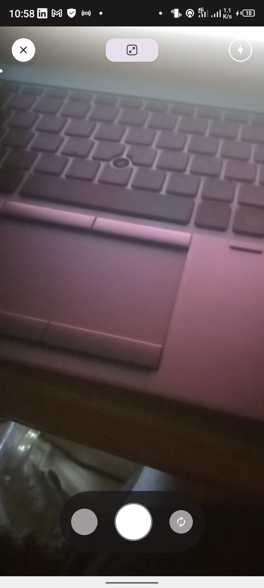
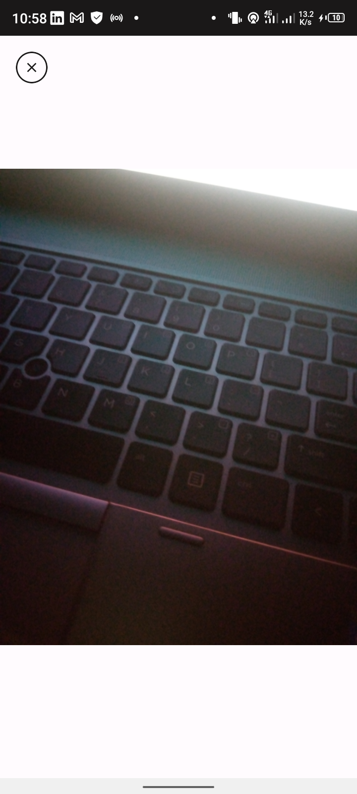

# Electronic Component Classifier 

## Overview 
    This is a demo project to showcase the possibility of identifying electronic components by the use of an android app. For identification, the app uses the **Tensorflow library.** 

## User Interface Design 
The User Interface makes up the visible parts of the application software. It is a term used to describe all the points of human-computer interaction and communication in the application, or generally in any machine. Accompanying the User Interface, is the User Experience. Based on the given User Interface, the overall experience the user derives from interacting with the software, including the aesthetic appearance, the response times, content presentation, all fall under the User Experience. Hence, a good UI leads to a good UX.

### Screens 
In this application, the UI was designed using the Figma design tool. Below are screenshots showing the various screens as embedded in the application.

## Application Software Architecture 
## Feature Implementation 
## 

